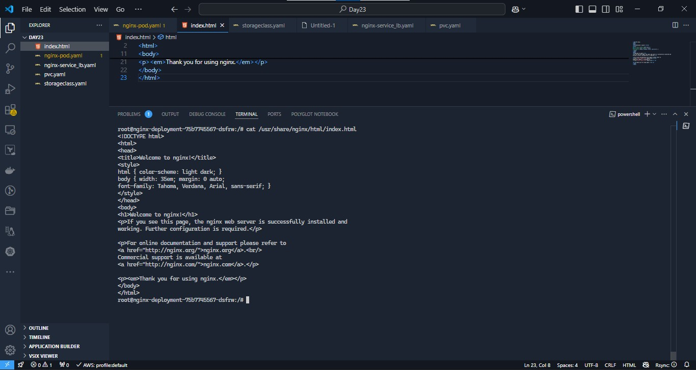

### Data Persistence in Kubernetes

Have an EKS cluster set up. 

Containers are stateless by design, data does not persist in the containers. A container running in kubernetes pods will still be stateless unless its configured to support statefulness. 

To achieve statefulness in kubernetes, knowledge volumes, persistent volumes, and persistent volume claim will be applied.


### Volumes

On-disk files in a container are ephemeral, which presents some problems for non-trivial applications when running in containers. One problem is the loss of files when a container crashes. The kubelet restarts the container but with a clean state. A second problem occurs when sharing files between containers running together in a Pod. The Kubernetes volume abstraction solves both of these problems.

Docker has a concept of volumes, though it is somewhat looser and less managed. A Docker volume is a directory on disk or in another container. Docker provides volume drivers, but the functionality is somewhat limited.

Kubernetes supports many types of volumes. A Pod can use any number of volume types simultaneously. 
**Ephemeral volume** types have a lifetime of a pod, but **persistent volumes** exist beyond the lifetime of a pod. When a pod ceases to exist, Kubernetes destroys ephemeral volumes; however, Kubernetes does not destroy persistent volumes. For any kind of volume in a given pod, data is preserved across container restarts.

At its core, a volume is a directory, possibly with some data in it, which is accessible to the containers in a pod. How that directory comes to be, the medium that backs it, and the contents of it are all determined by the particular volume type used. This means, you must know some of the different types of volumes available in kubernetes before choosing what is ideal for your particular use case.

A list of a few of them - 

#### awsElasticBlockStore

An awsElasticBlockStore volume mounts an Amazon Web Services (AWS) EBS volume into your pod. The contents of an EBS volume are persisted and the volume is only unmmounted when the pod crashes, or terminates. This means that an EBS volume can be pre-populated with data, and that data can be shared between pods.
Creating an NGINX pod with data persistence using ```awsElasticBlockStore``` will have a config like below - 

```
sudo cat <<EOF | sudo tee ./nginx-pod.yaml
apiVersion: apps/v1
kind: Deployment
metadata:
  name: nginx-deployment
  labels:
    tier: frontend
spec:
  replicas: 1
  selector:
    matchLabels:
      tier: frontend
  template:
    metadata:
      labels:
        tier: frontend
    spec:
      containers:
      - name: nginx
        image: nginx:latest
        ports:
        - containerPort: 80
      volumes:
      - name: nginx-volume
        # This AWS EBS volume must already exist.
        awsElasticBlockStore:
          volumeID: "<volume id>"
          fsType: ext4
EOF
```
**NOTE** - 
1. The volume section indicate the ttype of volume to be used to ensure persistence.

2. There is a  **volumeID** specified, therefore the **EBS** volume resource must be created prior the pod deployment, either in the AWS console or by using ```aws ec2 create-volume```

3. The nodes on which pods are running must be AWS EC2 instances
4. Those instances need to be in the same region and availability zone as the EBS volume
5. EBS only supports a single EC2 instance mounting a volume

So, create a pod without a volume. - So we can use its region and AZ to create the EBS volume then update the pod/deployment with the volume ID  of the EBS volume.

**For a Pod without volume**
``` 
sudo cat <<EOF | sudo tee ./nginx-pod.yaml
apiVersion: apps/v1
kind: Deployment
metadata:
  name: nginx-deployment
  labels:
    tier: frontend
spec:
  replicas: 3
  selector:
    matchLabels:
      tier: frontend
  template:
    metadata:
      labels:
        tier: frontend
    spec:
      containers:
      - name: nginx
        image: nginx:latest
        ports:
        - containerPort: 80
EOF
```

Now that we have the pod running without a volume, Lets now create a volume from the AWS console.

1. In your AWS console, head over to the EC2 section and scroll down to the Elastic Block Storage menu.
2. Click on Volumes
3. At the top right, click on Create Volume 


Part of the requirements is to ensure that the volume exists in the same region and availability zone as the EC2 instance running the pod. 
For e.g - we have our EC2 instance on ```us-east-2b```.

Can the EBS volume -
 ``` 
  aws ec2 create-volume --availability-zone us-east-2b --size 10 --volume-type gp2
 ```
 Then upload the deployment yml  file with the volume ID of the EBS volume created.

 

 

Now this pod has a volume, it can persist data if the pod restarts. Although the pod can be used for stateful applications, the configuration is not yet complete. This is  because, the volume is not yet mounted to any specific filesystem inside the container. The directory  ``` /usr/share/nginx/html ``` whihc holds the software/website code is still ephemeral, and if there is any kind of update to the ```index.html``` file, the new changes will only be there for as long as the po is still running. If the pod dies after, all previously written data will be erased.

To complete the configuration, we will need to add another section to the deployment yaml manifest. The ```volumeMounts``` which basically answers the question "Where should this Volume be mounted inside the container?" Mounting a volume to a directory means that all data written to the directory will be stored on that volume.

**volumeMounts**

```
cat <<EOF | tee ./nginx-pod.yaml
apiVersion: apps/v1
kind: Deployment
metadata:
  name: nginx-deployment
  labels:
    tier: frontend
spec:
  replicas: 1
  selector:
    matchLabels:
      tier: frontend
  template:
    metadata:
      labels:
        tier: frontend
    spec:
      containers:
      - name: nginx
        image: nginx:latest
        ports:
        - containerPort: 80
        volumeMounts:
        - name: nginx-volume
          mountPath: /usr/share/nginx/
      volumes:
      - name: nginx-volume
        # This AWS EBS volume must already exist.
        awsElasticBlockStore:
          volumeID: "	vol-07b537651bbe68be0"
          fsType: ext4
EOF
```
Notice the newly added section:

```
        volumeMounts:
        - name: nginx-volume
          mountPath: /usr/share/nginx/
``` 

* The value provided to ```name``` in ```volumeMounts``` must be the same value used in the ```volumes``` section. It simly gives the instruction to mount the volume with the name provided, to the provided mountpath.

Although we have set up a pod for data persistence, there are still some noteworthy points.

1. If you port forward the service and try to reach the endpoint, you will get a 403 error. This is because mounting a volume on a filesystem that already contains data will automatically erase all the existing data. This strategy for statefulness is preferred if the mounted volume already contains the data which you want to be made available to the container.

2. Notice it was the manual approach used to set up the pods, RDS volume and then the pod manifest update, this method is not efficient enough for the entire devops process. 
A more fluid way is to achieve same goal with Persistent Volume and Persistent Volume claims.

Ways of persistn=ing data in kubernetes

1. **Persistent Volume (PV) and Persistent Volume Claim (PVC)**

2. **configMap**

#### Managing Volumes Dynamically with PVs and PVCs

Kubernetes provides API objects for storage management such that, the lower level details of volume provisioning, storage allocation, access management etc are all abstracted away from the user such that a simple manifest file thats describes the task is used to get the job done.

**PVs** are volume plugins that have a lifecycle completely independent of any individual Pod that uses the PV. This means that even when a pod dies, the PV remains. A **PV** is a piece of storage in the cluster that is either provisioned by an administrator through a manifest file, or it can be dynamically created if a storage class has been pre-configured.

Creating a PV manually is like what we have done previously where with creating the volume from the console. As much as possible, we should allow PVs to be created automatically just be adding it to the container spec iin deployments. **But without a storageclass present in the cluster, PVs cannot be automatically created.**

If your infrastructure relies on a storage system such as NFS, iSCSI or a cloud provider-specific storage system such as EBS on AWS, then you can dynamically create a PV which will create a volume that a Pod can then use. This means that there must be a **storageClass** resource in the cluster before a PV can be provisioned.

By default, in EKS, there is a default **storageClass** configured as part of EKS installation. This storageclass is based on **gp2** which is Amazon's default type of volume for Elastic block storage.**gp2** is backled by solid-state drives (SSDs) which means they are suitable for a broad range of transactional workloads.

To find the storageclass in your cluster -

``` kubectl get storageclass ``` 

To create a storageclass, see the manifest below - 

```
  kind: StorageClass
  apiVersion: storage.k8s.io/v1
  metadata:
    name: gp2
    annotations:
      storageclass.kubernetes.io/is-default-class: "true"
  provisioner: kubernetes.io/aws-ebs
  parameters:
    type: gp2
    fsType: ext4 
``` 
A **PersistentVolumeClaim (PVC)** on the other hand is a request for storage. Just as Pods consume node resources, PVCs consume PV resources. Pods can request specific levels of resources (CPU and Memory). Claims can request specific size and access modes (e.g., they can be mounted ReadWriteOnce, ReadOnlyMany or ReadWriteMany, see AccessModes).

**Lifecycle of a PV and PVC**

PVs are resources in the cluster. PVCs are requests for those resources and also act as claim checks to the resource. The interaction between PVs and PVCs follows this lifecycle:

1. **Provisioning**: There are two ways PVs may be provisioned: statically or dynamically.

    * **Static/Manual Provisioning**: A cluster administrator creates a number of PVs using a manifest file which will contain all the details of the real storage. PVs are not scoped to namespaces, they a clusterwide wide resource, therefore the PV will be available for use when requested. PVCs on the other hand are namespace scoped.
    * **Dynamic**: When there is no PV matching a PVC's request, then based on the available StorageClass, a dynamic PV will be created for use by the PVC. If there is not StorageClass, then the request for a PV by the PVC will fail.

2. **Binding**: PVCs are bound to specifiv PVs. This binding is exclusive. A PVC to PV binding is a one-to-one mapping. Claims will remain unbound indefinitely if a matching volume does not exist. Claims will be bound as matching volumes become available. For example, a cluster provisioned with many 50Gi PVs would not match a PVC requesting 100Gi. The PVC can be bound when a 100Gi PV is added to the cluster. 

3. **Using:**  Pods use claims as volumes. The cluster inspects the claim to find the bound volume and mounts that volume for a Pod. For volumes that support multiple access modes, the user specifies which mode is desired when using their claim as a volume in a Pod. Once a user has a claim and that claim is bound, the bound PV belongs to the user for as long as they need it. Users schedule Pods and access their claimed PVs by including a persistentVolumeClaim section in a Pod's volumes block.

4. **Storage Object in Use Protection**: The purpose of the Storage Object in Use Protection feature is to ensure that PersistentVolumeClaims (PVCs) in active use by a Pod and PersistentVolume (PVs) that are bound to PVCs are not removed from the system, as this may result in data loss. Note: PVC is in active use by a Pod when a Pod object exists that is using the PVC. If a user deletes a PVC in active use by a Pod, the PVC is not removed immediately. PVC removal is postponed until the PVC is no longer actively used by any Pods. Also, if an admin deletes a PV that is bound to a PVC, the PV is not removed immediately. PV removal is postponed until the PV is no longer bound to a PVC.

5. **Reclaiming**: When a user is done with their volume, they can delete the PVC objects from the API that allows reclamation of the resource. The reclaim policy for a PersistentVolume tells the cluster what to do with the volume after it has been released of its claim. Currently, volumes can either be Retained, Recycled, or Deleted.

     * Retain:  The **Retain** reclaim policy allows for manual reclamation of the resource. When the PersistentVolumeClaim is deleted, the PersistentVolume still exists and the volume is considered "released". But it is not yet available for another claim because the previous claimant's data remains on the volume.
     * Delete: For volume plugins that support the Delete reclaim policy, deletion removes both the PersistentVolume object from Kubernetes, as well as the associated storage asset in the external infrastructure, such as an AWS EBS. Volumes that were dynamically provisioned inherit the reclaim policy of their StorageClass, which defaults to **Delete**

**NOTES**:

1. When PVCs are created with a specific size, it cannot be expanded except the storageClass is configured to allow expansion with the **allowVolumeExpansion** field is set to true in the manifest YAML file. This is "unset" by default in EKS.
2. When a PV has been provisioned in a specific availability zone, only pods running in that zone can use the PV. If a pod spec containing a PVC is created in another AZ and attempts to reuse an already bound PV, then the pod will remain in pending state and report ```volume node affinity conflict.``` Anytime you see this message, this will help you to understand what the problem is.
3. PVs are not scoped to namespaces, they a clusterwide wide resource. PVCs on the other hand are namespace scoped.

Learn more about the different types of [persistent volumes here](https://kubernetes.io/docs/concepts/storage/persistent-volumes/#types-of-persistent-volumes)

**Creating persistence for an nginx deployment.**

**STEPS**
1. Create the PVC
2. In the poddeployment manifest, specify the PVC in the ```spec```.```volumes```.

1. Create a manifest file for a PVC, and based on the gp2 storageClass a PV will be dynamically created

```
    apiVersion: v1
    kind: PersistentVolumeClaim
    metadata:
      name: nginx-volume-claim
    spec:
      accessModes:
      - ReadWriteOnce
      resources:
        requests:
          storage: 2Gi
      storageClassName: gp2
``` 

Apply the manifest to create the PVC.


*Notice that it is in pending state. (kubectl get pvc)*

At this point, no PV is created yet, because a settting in the storageclass ```VolumeBindingMode``` is set on ``` WaitForFirstConsumer``` 

Then apply the **PVC** to the deployment manifest to create the **PV**.

```
    apiVersion: apps/v1
    kind: Deployment
    metadata:
      name: nginx-deployment
      labels:
        tier: frontend
    spec:
      replicas: 1
      selector:
        matchLabels:
          tier: frontend
      template:
        metadata:
          labels:
            tier: frontend
        spec:
          containers:
          - name: nginx
            image: nginx:latest
            ports:
            - containerPort: 80
            volumeMounts:
            - name: nginx-volume-claim
              mountPath: "/tmp/staxx"
          volumes:
          - name: nginx-volume-claim
            persistentVolumeClaim:
              claimName: nginx-volume-claim
``` 


The volumes section now has a persistentVolumeClaim. With the new deployment manifest, the /tmp/staxx directory will be persisted, and any data written in there will be sotred permanetly on the volume, which can be used by another Pod if the current one gets replaced.

Run ``` kubectl get pv``` to view the PV created.

The PV creation could be effected with just one manifest file instead of two like we did above. In that case, the Deployment manifest will have a ```volumeClaimTemplate``` within the Pod spec and the pvc manifest will also be added within deployment manifest.


**ConfigMap**

Using configMaps for persistence is not something you would consider for data storage. Rather it is a way to manage configuration files and ensure they are not lost as a result of Pod replacement.

Lets illustrate this with the HTML file in-built in NGINX in the ```/usr/share/nginx/html/index.html ``` directory.

1. Create a depoyment for the NGINX pod. Also create a service to access the appklication.

```
---
apiVersion: apps/v1
kind: Deployment
metadata:
  name: nginx-deployment
  labels:
    tier: frontend
spec:
  replicas: 1
  selector:
    matchLabels:
      tier: frontend
  template:
    metadata:
      labels:
        tier: frontend
    spec:
      containers:
        - name: nginx
          image: nginx:latest
          ports:
            - containerPort: 80
```

The service for the nginx
```
apiVersion: v1
kind: Service
metadata:
  name: nginx-service
spec:
  type: LoadBalancer
  selector:
    tier: frontend
  ports:
    - protocol: TCP
      port: 80 # This is the port the Loadbalancer is listening at
      targetPort: 80 # This is the port the container is listening at
```


2. Get name of the pod (kubect get pods)
    Exec into the pod ( kubectl exec)

    ```cat``` the **/usr/share/nginx/html/index.html** and copy the text and save on your local PC, will use the edited file to create a configmap.


**Persisting configuration data with configMaps**

A ConfigMap is an API object used to store non-confidential data in key-value pairs. Pods can consume ConfigMaps as environment variables, command-line arguments, or as configuration files in a volume.
Here we will use it to create a file in a volume.

The configmap will look like below 

```
apiVersion: v1
kind: ConfigMap
metadata:
  name: website-index-file
data:
  # file to be mounted inside a volume
  index-file: |
    <!DOCTYPE html>
    <html>
    <head>
    <title>Welcome to a new day!</title>
    <style>
    html { color-scheme: light dark; }
    body { width: 35em; margin: 0 auto;
    font-family: Tahoma, Verdana, Arial, sans-serif; }
    </style>
    </head>
    <body>
    <h1>Welcome to a new day!</h1>
    <p>If you see this page, you are Awesome!.</p>

    <p>For online documentation and support please refer to
    <a href="http://nginx.org/">nginx.org</a>.<br/>
    Commercial support is available at
    <a href="http://nginx.com/">nginx.com</a>.</p>

    <p><em>Thank you for using nginx.</em></p>
    </body>
    </html>
```
* Apply the new manifest file.

```kubectl apply -f nginx-configmap.yaml``` 
* Update the deployment file to use the configmap in the volumeMounts section

```
---
apiVersion: apps/v1
kind: Deployment
metadata:
  name: nginx-deployment
  labels:
    tier: frontend
spec:
  replicas: 1
  selector:
    matchLabels:
      tier: frontend
  template:
    metadata:
      labels:
        tier: frontend
    spec:
      containers:
        - name: nginx
          image: nginx:latest
          ports:
            - containerPort: 80
          volumeMounts:
          - name: config
            mountPath: /usr/share/nginx/html
            readOnly: true
      volumes:
      - name: config
        configMap:
          name: website-index-file
          items:
          - key: index-file
            path: index.html
```
* Now the index.html file is no longer ephemeral because it is using a configMap that has been mounted onto the filesystem. This is now evident when you exec into the pod and list the /usr/share/nginx/html directory

```
  root@nginx-deployment-84b799b888-fqzwk:/# ls -ltr  /usr/share/nginx/html
  lrwxrwxrwx 1 root root 17 Feb 19 16:16 index.html -> ..data/index.html
```


You can now see that the index.html is now a soft link to ../data

3.  In conclusion, get endpoint of the service (kubectl get svc)

    Input the address in the browser and see the edited page.

    

You can restart the deployment

```
    kubectl rollout restart deploy nginx-deployment 
```
This will terminate the running pod and spin up a new one. Observe the data persistence.

Remember to clean up your cluster after you are done to prevent cloud costs.

